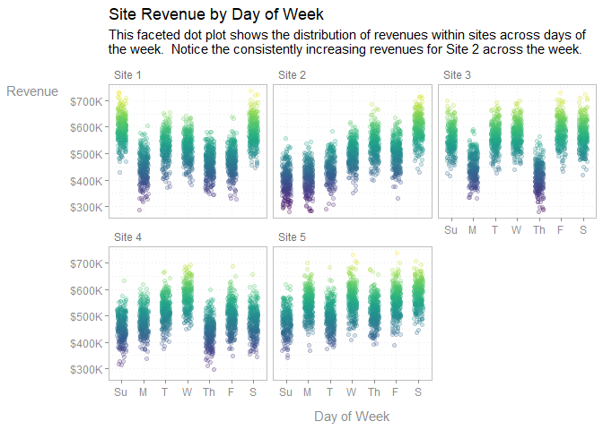
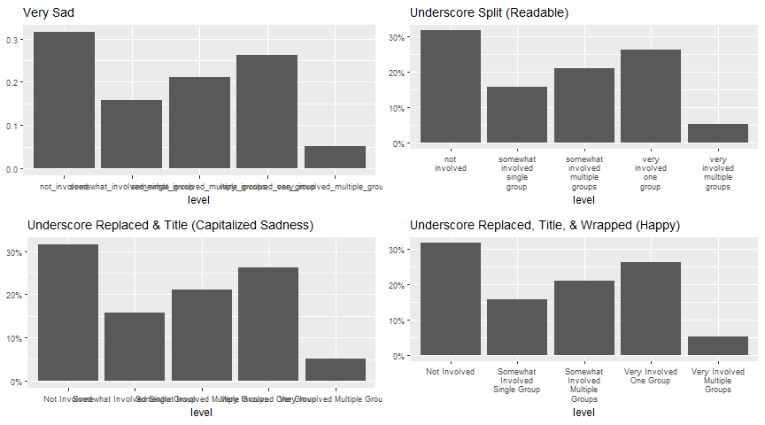
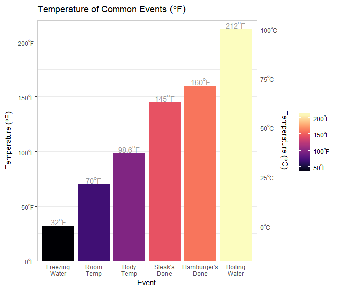
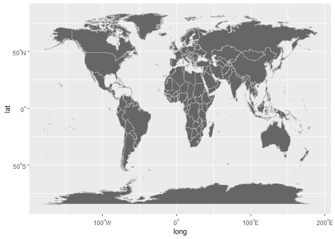
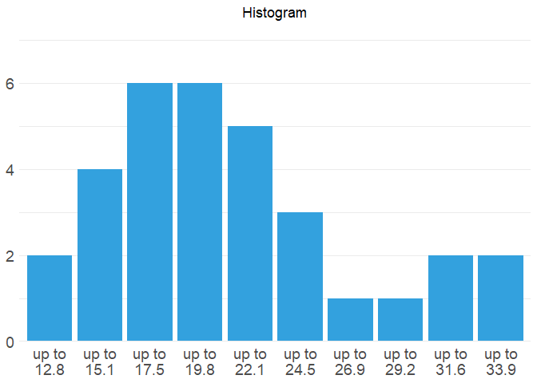
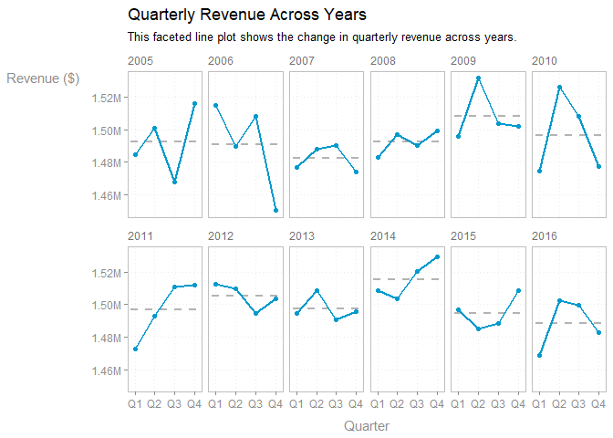
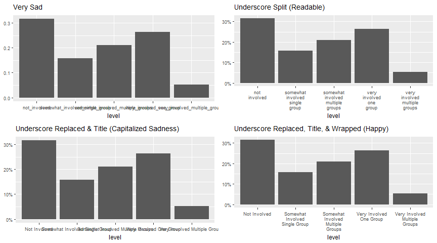

numform   
============

**numform** contains tools to assist in the formatting of numbers and
plots for publication. Tools include the removal of leading zeros,
standardization of number of digits, addition of affixes, and a p-value
formatter. These tools combine the functionality of several 'base'
functions such as `paste()`, `format()`, and `sprintf()` into specific
use case functions that are named in a way that is consistent with
usage, making their names easy to remember and easy to deploy.

Installation
============

To download the development version of **numform**:

Download the [zip
ball](https://github.com/trinker/numform/zipball/master) or [tar
ball](https://github.com/trinker/numform/tarball/master), decompress and
run `R CMD INSTALL` on it, or use the **pacman** package to install the
development version:

    if (!require("pacman")) install.packages("pacman")
    pacman::p_load_current_gh("trinker/numform")
    pacman::p_load(tidyverse, gridExtra)

Table of Contents
============

-   [Installation](#installation)
-   [Contact](#contact)
-   [Available Functions](#available-functions)
-   [Demonstration](#demonstration)
    -   [Load Packages](#load-packages)
    -   [Numbers](#numbers)
    -   [Abbreviated Numbers](#abbreviated-numbers)
    -   [Commas](#commas)
    -   [Percents](#percents)
    -   [Dollars](#dollars)
    -   [Tables](#tables)
    -   [Plotting](#plotting)
    -   [Modeling](#modeling)

Contact
============

You are welcome to:    
- submit suggestions and bug-reports at: <https://github.com/trinker/numform/issues>    
- send a pull request on: <https://github.com/trinker/numform/>    
- compose a friendly e-mail to: <tyler.rinker@gmail.com>    

Available Functions
===================

Below is a table of available **numform** functions. Note that `f_` is
read as "format" whereas `fv_` is read as "format vector". The former
formats individual values in the vector while the latter uses the vector
to compute a calculation on each of the values and then formats them.
Additionally, all **numform** `f_` functions have a closure, function
retuning, version that is prefixed with an additional `f` (read "format
function"). For example, `f_num` has `ff_num` which has the same
arguments but returns a function instead. This is useful for passing in
to **ggplot2** `scale_x/y_type` functions (see [Plotting](#plotting) for
usage).

<!-- html table generated in R 3.5.1 by xtable 1.8-3 package -->
<!-- Thu Jan 17 08:14:34 2019 -->
<table>
<tr>
<td>
alignment
</td>
<td>
f_byte
</td>
<td>
f_latitude
</td>
<td>
f_peta
</td>
<td>
f_weekday_abbreviation
</td>
</tr>
<tr>
<td>
as_factor
</td>
<td>
f_celcius
</td>
<td>
f_list
</td>
<td>
f_pp
</td>
<td>
f_weekday_name
</td>
</tr>
<tr>
<td>
collapse
</td>
<td>
f_comma
</td>
<td>
f_list_amp
</td>
<td>
f_prefix
</td>
<td>
f_wrap
</td>
</tr>
<tr>
<td>
constant_months
</td>
<td>
f_data
</td>
<td>
f_logical
</td>
<td>
f_prop2percent
</td>
<td>
f_year
</td>
</tr>
<tr>
<td>
constant_months_abbreviation
</td>
<td>
f_data_abbreviation
</td>
<td>
f_longitude
</td>
<td>
f_pval
</td>
<td>
f_yotta
</td>
</tr>
<tr>
<td>
constant_quarters
</td>
<td>
f_date
</td>
<td>
f_mean_sd
</td>
<td>
f_quarter
</td>
<td>
f_zetta
</td>
</tr>
<tr>
<td>
constant_weekdays
</td>
<td>
f_degree
</td>
<td>
f_mega
</td>
<td>
f_replace
</td>
<td>
fv_num_percent
</td>
</tr>
<tr>
<td>
constant_weekdays_abbreviation
</td>
<td>
f_denom
</td>
<td>
f_mills
</td>
<td>
f_response
</td>
<td>
fv_percent
</td>
</tr>
<tr>
<td>
f_12_hour
</td>
<td>
f_dollar
</td>
<td>
f_month
</td>
<td>
f_sign
</td>
<td>
fv_percent_diff
</td>
</tr>
<tr>
<td>
f_abbreviation
</td>
<td>
f_exa
</td>
<td>
f_month_abbreviation
</td>
<td>
f_state
</td>
<td>
fv_percent_diff_fixed_relative
</td>
</tr>
<tr>
<td>
f_affirm
</td>
<td>
f_fahrenheit
</td>
<td>
f_month_name
</td>
<td>
f_suffix
</td>
<td>
fv_percent_lead
</td>
</tr>
<tr>
<td>
f_affix
</td>
<td>
f_giga
</td>
<td>
f_num
</td>
<td>
f_tera
</td>
<td>
fv_percent_lead_fixed_relative
</td>
</tr>
<tr>
<td>
f_bills
</td>
<td>
f_interval
</td>
<td>
f_num_percent
</td>
<td>
f_text_bar
</td>
<td>
fv_runs
</td>
</tr>
<tr>
<td>
f_bin
</td>
<td>
f_interval_right
</td>
<td>
f_ordinal
</td>
<td>
f_thous
</td>
<td>
glue
</td>
</tr>
<tr>
<td>
f_bin_right
</td>
<td>
f_interval_text
</td>
<td>
f_pad_zero
</td>
<td>
f_title
</td>
<td>
highlight_cells
</td>
</tr>
<tr>
<td>
f_bin_text
</td>
<td>
f_interval_text_right
</td>
<td>
f_parenthesis
</td>
<td>
f_trills
</td>
<td>
</td>
</tr>
<tr>
<td>
f_bin_text_right
</td>
<td>
f_kilo
</td>
<td>
f_percent
</td>
<td>
f_weekday
</td>
<td>
</td>
</tr>
</table>

<b><em>Available Formatting Functions</em></b>

Demonstration
=============

Load Packages
-------------

    if (!require("pacman")) install.packages("pacman")
    pacman::p_load_gh("trinker/numform")
    pacman::p_load(dplyr)

Numbers
-------

    f_num(c(0.0, 0, .2, -00.02, 1.122222, pi, "A"))

    ## [1] ".0"  ".0"  ".2"  "-.0" "1.1" "3.1" NA

Abbreviated Numbers
-------------------

    f_thous(1234)

    ## [1] "1K"

    f_thous(12345)

    ## [1] "12K"

    f_thous(123456)

    ## [1] "123K"

    f_mills(1234567)

    ## [1] "1M"

    f_mills(12345678)

    ## [1] "12M"

    f_mills(123456789)

    ## [1] "123M"

    f_bills(1234567891)

    ## [1] "1B"

    f_bills(12345678912)

    ## [1] "12B"

    f_bills(123456789123)

    ## [1] "123B"

...or auto-detect:

    f_denom(1234)

    ## [1] "1K"

    f_denom(12345)

    ## [1] "12K"

    f_denom(123456)

    ## [1] "123K"

    f_denom(1234567)

    ## [1] "1M"

    f_denom(12345678)

    ## [1] "12M"

    f_denom(123456789)

    ## [1] "123M"

    f_denom(1234567891)

    ## [1] "1B"

    f_denom(12345678912)

    ## [1] "12B"

    f_denom(123456789123)

    ## [1] "123B"

Commas
------

    f_comma(c(1234.12345, 1234567890, .000034034, 123000000000, -1234567))

    ## [1] "1,234.123"       "1,234,567,890"   ".000034034"      "123,000,000,000"
    ## [5] "-1,234,567"

Percents
--------

    f_percent(c(30, 33.45, .1), digits = 1)

    ## [1] "30.0%" "33.5%" ".1%"

    f_percent(c(0.0, 0, .2, -00.02, 1.122222, pi))

    ## [1] ".0%"  ".0%"  ".2%"  "-.0%" "1.1%" "3.1%"

    f_prop2percent(c(.30, 1, 1.01, .33, .222, .01))

    ## [1] "30.0%"  "100.0%" "101.0%" "33.0%"  "22.2%"  "1.0%"

    f_prop2percent(c(.30, 1, 1.01, .33, .222, .01), digits = 0)

    ## [1] "30%"  "100%" "101%" "33%"  "22%"  "1%"

    f_pp(c(.30, 1, 1.01, .33, .222, .01)) # same as f_prop2percent(digits = 0)

    ## [1] "30%"  "100%" "101%" "33%"  "22%"  "1%"

Dollars
-------

    f_dollar(c(0, 30, 33.45, .1))

    ## [1] "$0.00"  "$30.00" "$33.45" "$0.10"

    f_dollar(c(0.0, 0, .2, -00.02, 1122222, pi)) %>% 
        f_comma()

    ## [1] "$0.00"         "$0.00"         "$0.20"         "$-.02"        
    ## [5] "$1,122,222.00" "$3.14"

Sometimes one wants to lop off digits of money in order to see the
important digits, the real story. The `f_denom` family of functions can
do job.

    f_denom(c(12345267, 98765433, 658493021), prefix = '$')

    ## [1] "$ 12M" "$ 99M" "$658M"

    f_denom(c(12345267, 98765433, 658493021), relative = 1, prefix = '$')

    ## [1] "$ 12.3M" "$ 98.8M" "$658.5M"

Tables
------

Notice the use of the `alignment` function to detect the column
alignment.

    pacman::p_load(dplyr, pander)

    set.seed(10)
    dat <- data_frame(
        Team = rep(c("West Coast", "East Coast"), each = 4),
        Year = rep(2012:2015, 2),
        YearStart = round(rnorm(8, 2e6, 1e6) + sample(1:10/100, 8, TRUE), 2),
        Won = round(rnorm(8, 4e5, 2e5) + sample(1:10/100, 8, TRUE), 2),
        Lost = round(rnorm(8, 4.4e5, 2e5) + sample(1:10/100, 8, TRUE), 2),
        WinLossRate = Won/Lost,
        PropWon = Won/YearStart,
        PropLost = Lost/YearStart
    )

    dat %>%
        group_by(Team) %>%
        mutate(
            `%&Delta;WinLoss` = fv_percent_diff(WinLossRate, 0),
            `&Delta;WinLoss` = f_sign(Won - Lost, '<b>+</b>', '<b>&ndash;</b>')
            
        ) %>%
        ungroup() %>%
        mutate_at(vars(Won:Lost), .funs = ff_denom(relative = -1, prefix = '$')) %>%
        mutate_at(vars(PropWon, PropLost), .funs = ff_prop2percent(digits = 0)) %>%
        mutate(
            YearStart = f_denom(YearStart, 1, prefix = '$'),
            Team = fv_runs(Team),
            WinLossRate = f_num(WinLossRate, 1)
        ) %>%
        data.frame(stringsAsFactors = FALSE, check.names = FALSE) %>%
        pander::pander(split.tables = Inf, justify = alignment(.), style = 'simple')

<table>
<thead>
<tr class="header">
<th align="left">Team</th>
<th align="right">Year</th>
<th align="right">YearStart</th>
<th align="right">Won</th>
<th align="right">Lost</th>
<th align="right">WinLossRate</th>
<th align="right">PropWon</th>
<th align="right">PropLost</th>
<th align="right">%ΔWinLoss</th>
<th align="right">ΔWinLoss</th>
</tr>
</thead>
<tbody>
<tr class="odd">
<td align="left">West Coast</td>
<td align="right">2012</td>
<td align="right">$2.0M</td>
<td align="right">$350K</td>
<td align="right">$190K</td>
<td align="right">1.9</td>
<td align="right">17%</td>
<td align="right">9%</td>
<td align="right">0%</td>
<td align="right"><b>+</b></td>
</tr>
<tr class="even">
<td align="left"></td>
<td align="right">2013</td>
<td align="right">$1.8M</td>
<td align="right">$600K</td>
<td align="right">$370K</td>
<td align="right">1.6</td>
<td align="right">33%</td>
<td align="right">20%</td>
<td align="right">-13%</td>
<td align="right"><b>+</b></td>
</tr>
<tr class="odd">
<td align="left"></td>
<td align="right">2014</td>
<td align="right">$ .6M</td>
<td align="right">$550K</td>
<td align="right">$300K</td>
<td align="right">1.8</td>
<td align="right">87%</td>
<td align="right">48%</td>
<td align="right">11%</td>
<td align="right"><b>+</b></td>
</tr>
<tr class="even">
<td align="left"></td>
<td align="right">2015</td>
<td align="right">$1.4M</td>
<td align="right">$420K</td>
<td align="right">$270K</td>
<td align="right">1.6</td>
<td align="right">30%</td>
<td align="right">19%</td>
<td align="right">-13%</td>
<td align="right"><b>+</b></td>
</tr>
<tr class="odd">
<td align="left">East Coast</td>
<td align="right">2012</td>
<td align="right">$2.3M</td>
<td align="right">$210K</td>
<td align="right">$420K</td>
<td align="right">.5</td>
<td align="right">9%</td>
<td align="right">18%</td>
<td align="right">0%</td>
<td align="right"><b>–</b></td>
</tr>
<tr class="even">
<td align="left"></td>
<td align="right">2013</td>
<td align="right">$2.4M</td>
<td align="right">$360K</td>
<td align="right">$390K</td>
<td align="right">.9</td>
<td align="right">15%</td>
<td align="right">16%</td>
<td align="right">86%</td>
<td align="right"><b>–</b></td>
</tr>
<tr class="odd">
<td align="left"></td>
<td align="right">2014</td>
<td align="right">$ .8M</td>
<td align="right">$590K</td>
<td align="right">$ 70K</td>
<td align="right">8.4</td>
<td align="right">74%</td>
<td align="right">9%</td>
<td align="right">811%</td>
<td align="right"><b>+</b></td>
</tr>
<tr class="even">
<td align="left"></td>
<td align="right">2015</td>
<td align="right">$1.6M</td>
<td align="right">$500K</td>
<td align="right">$420K</td>
<td align="right">1.2</td>
<td align="right">30%</td>
<td align="right">26%</td>
<td align="right">-86%</td>
<td align="right"><b>+</b></td>
</tr>
</tbody>
</table>

    pacman::p_load(dplyr, pander)

    data_frame(
        Event = c('freezing water', 'room temp', 'body temp', 'steak\'s done', 'hamburger\'s done', 'boiling water', 'sun surface', 'lighting'),
        F = c(32, 70, 98.6, 145, 160, 212, 9941, 50000)
    ) %>%
        mutate(
            Event = f_title(Event),
            C = (F - 32) * (5/9)
        ) %>%
        mutate(
            F = f_degree(F, measure = 'F', type = 'string'),
            C = f_degree(C, measure = 'C', type = 'string', zero = '0.0')
        )  %>%
        data.frame(stringsAsFactors = FALSE, check.names = FALSE) %>%
        pander::pander(split.tables = Inf, justify = alignment(.), style = 'simple')

<table>
<thead>
<tr class="header">
<th align="left">Event</th>
<th align="right">F</th>
<th align="right">C</th>
</tr>
</thead>
<tbody>
<tr class="odd">
<td align="left">Freezing Water</td>
<td align="right">32.0°F</td>
<td align="right">0.0°C</td>
</tr>
<tr class="even">
<td align="left">Room Temp</td>
<td align="right">70.0°F</td>
<td align="right">21.1°C</td>
</tr>
<tr class="odd">
<td align="left">Body Temp</td>
<td align="right">98.6°F</td>
<td align="right">37.0°C</td>
</tr>
<tr class="even">
<td align="left">Steak's Done</td>
<td align="right">145.0°F</td>
<td align="right">62.8°C</td>
</tr>
<tr class="odd">
<td align="left">Hamburger's Done</td>
<td align="right">160.0°F</td>
<td align="right">71.1°C</td>
</tr>
<tr class="even">
<td align="left">Boiling Water</td>
<td align="right">212.0°F</td>
<td align="right">100.0°C</td>
</tr>
<tr class="odd">
<td align="left">Sun Surface</td>
<td align="right">9941.0°F</td>
<td align="right">5505.0°C</td>
</tr>
<tr class="even">
<td align="left">Lighting</td>
<td align="right">50000.0°F</td>
<td align="right">27760.0°C</td>
</tr>
</tbody>
</table>

    if (!require("pacman")) install.packages("pacman")
    pacman::p_load(tidyverse)

    set.seed(11)
    data_frame(
        date = sample(seq(as.Date("1990/1/1"), by = "day", length.out = 2e4), 12)
    ) %>%
        mutate(
            year_4 = f_year(date, 4),
            year_2 = f_year(date, 2),
            quarter = f_quarter(date),
            month_name = f_month_name(date) %>%
                numform::as_factor(),
            month_abbreviation = f_month_abbreviation(date) %>%
                numform::as_factor(),
            month_short = f_month(date),
            weekday_name = f_weekday_name(date),
            weekday_abbreviation = f_weekday_abbreviation(date),
           weekday_short = f_weekday(date),
            weekday_short_distinct = f_weekday(date, distinct = TRUE)
        ) %>%
        data.frame(stringsAsFactors = FALSE, check.names = FALSE) %>%
        pander::pander(split.tables = Inf, justify = alignment(.), style = 'simple')

<table>
<thead>
<tr class="header">
<th align="right">date</th>
<th align="right">year_4</th>
<th align="right">year_2</th>
<th align="left">quarter</th>
<th align="left">month_name</th>
<th align="left">month_abbreviation</th>
<th align="left">month_short</th>
<th align="left">weekday_name</th>
<th align="left">weekday_abbreviation</th>
<th align="left">weekday_short</th>
<th align="left">weekday_short_distinct</th>
</tr>
</thead>
<tbody>
<tr class="odd">
<td align="right">2005-03-07</td>
<td align="right">2005</td>
<td align="right">05</td>
<td align="left">Q1</td>
<td align="left">March</td>
<td align="left">Mar</td>
<td align="left">M</td>
<td align="left">Monday</td>
<td align="left">Mon</td>
<td align="left">M</td>
<td align="left">M</td>
</tr>
<tr class="even">
<td align="right">1990-01-11</td>
<td align="right">1990</td>
<td align="right">90</td>
<td align="left">Q1</td>
<td align="left">January</td>
<td align="left">Jan</td>
<td align="left">J</td>
<td align="left">Thursday</td>
<td align="left">Thu</td>
<td align="left">T</td>
<td align="left">Th</td>
</tr>
<tr class="odd">
<td align="right">2017-12-16</td>
<td align="right">2017</td>
<td align="right">17</td>
<td align="left">Q4</td>
<td align="left">December</td>
<td align="left">Dec</td>
<td align="left">D</td>
<td align="left">Saturday</td>
<td align="left">Sat</td>
<td align="left">S</td>
<td align="left">S</td>
</tr>
<tr class="even">
<td align="right">1990-10-08</td>
<td align="right">1990</td>
<td align="right">90</td>
<td align="left">Q4</td>
<td align="left">October</td>
<td align="left">Oct</td>
<td align="left">O</td>
<td align="left">Monday</td>
<td align="left">Mon</td>
<td align="left">M</td>
<td align="left">M</td>
</tr>
<tr class="odd">
<td align="right">1993-07-17</td>
<td align="right">1993</td>
<td align="right">93</td>
<td align="left">Q3</td>
<td align="left">July</td>
<td align="left">Jul</td>
<td align="left">J</td>
<td align="left">Saturday</td>
<td align="left">Sat</td>
<td align="left">S</td>
<td align="left">S</td>
</tr>
<tr class="even">
<td align="right">2042-04-10</td>
<td align="right">2042</td>
<td align="right">42</td>
<td align="left">Q2</td>
<td align="left">April</td>
<td align="left">Apr</td>
<td align="left">A</td>
<td align="left">Thursday</td>
<td align="left">Thu</td>
<td align="left">T</td>
<td align="left">Th</td>
</tr>
<tr class="odd">
<td align="right">1994-09-26</td>
<td align="right">1994</td>
<td align="right">94</td>
<td align="left">Q3</td>
<td align="left">September</td>
<td align="left">Sep</td>
<td align="left">S</td>
<td align="left">Monday</td>
<td align="left">Mon</td>
<td align="left">M</td>
<td align="left">M</td>
</tr>
<tr class="even">
<td align="right">2005-11-15</td>
<td align="right">2005</td>
<td align="right">05</td>
<td align="left">Q4</td>
<td align="left">November</td>
<td align="left">Nov</td>
<td align="left">N</td>
<td align="left">Tuesday</td>
<td align="left">Tue</td>
<td align="left">T</td>
<td align="left">T</td>
</tr>
<tr class="odd">
<td align="right">2038-03-16</td>
<td align="right">2038</td>
<td align="right">38</td>
<td align="left">Q1</td>
<td align="left">March</td>
<td align="left">Mar</td>
<td align="left">M</td>
<td align="left">Tuesday</td>
<td align="left">Tue</td>
<td align="left">T</td>
<td align="left">T</td>
</tr>
<tr class="even">
<td align="right">1996-09-29</td>
<td align="right">1996</td>
<td align="right">96</td>
<td align="left">Q3</td>
<td align="left">September</td>
<td align="left">Sep</td>
<td align="left">S</td>
<td align="left">Sunday</td>
<td align="left">Sun</td>
<td align="left">S</td>
<td align="left">Su</td>
</tr>
<tr class="odd">
<td align="right">1999-08-02</td>
<td align="right">1999</td>
<td align="right">99</td>
<td align="left">Q3</td>
<td align="left">August</td>
<td align="left">Aug</td>
<td align="left">A</td>
<td align="left">Monday</td>
<td align="left">Mon</td>
<td align="left">M</td>
<td align="left">M</td>
</tr>
<tr class="even">
<td align="right">2014-02-14</td>
<td align="right">2014</td>
<td align="right">14</td>
<td align="left">Q1</td>
<td align="left">February</td>
<td align="left">Feb</td>
<td align="left">F</td>
<td align="left">Friday</td>
<td align="left">Fri</td>
<td align="left">F</td>
<td align="left">F</td>
</tr>
</tbody>
</table>

    mtcars %>%
        count(cyl, gear) %>%
        group_by(cyl) %>%
        mutate(
            p = numform::f_pp(n/sum(n))
        ) %>%
        ungroup() %>%
        mutate(
            cyl = numform::fv_runs(cyl),
            ` ` = f_text_bar(n)  ## Overall
        ) %>%
        as.data.frame()

      cyl gear  n   p          
    1   4    3  1  9% _        
    2        4  8 73% ______   
    3        5  2 18% __       
    4   6    3  2 29% __       
    5        4  4 57% ___      
    6        5  1 14% _        
    7   8    3 12 86% _________
    8        5  2 14% __       

Plotting
--------

    library(tidyverse); library(viridis)

    set.seed(10)
    data_frame(
        revenue = rnorm(10000, 500000, 50000),
        date = sample(seq(as.Date('1999/01/01'), as.Date('2000/01/01'), by="day"), 10000, TRUE),
        site = sample(paste("Site", 1:5), 10000, TRUE)
    ) %>%
        mutate(
            dollar = f_comma(f_dollar(revenue, digits = -3)),
            thous = f_denom(revenue),
            thous_dollars = f_denom(revenue, prefix = '$'),
            abb_month = f_month(date),
            abb_week = numform::as_factor(f_weekday(date, distinct = TRUE))
        ) %>%
        group_by(site, abb_week) %>%
        mutate(revenue = {if(sample(0:1, 1) == 0) `-` else `+`}(revenue, sample(1e2:1e5, 1))) %>%
        ungroup() %T>%
        print() %>%
        ggplot(aes(abb_week, revenue)) +
            geom_jitter(width = .2, height = 0, alpha = .2, aes(color = revenue)) +
            scale_y_continuous(label = ff_denom(prefix = '$'))+
            facet_wrap(~site) +
            theme_bw() +
            scale_color_viridis() +
            theme(
                strip.text.x = element_text(hjust = 0, color = 'grey45'),
                strip.background = element_rect(fill = NA, color = NA),
                panel.border = element_rect(fill = NA, color = 'grey75'),
                panel.grid = element_line(linetype = 'dotted'),
                axis.ticks = element_line(color = 'grey55'),
                axis.text = element_text(color = 'grey55'),
                axis.title.x = element_text(color = 'grey55', margin = margin(t = 10)),            
                axis.title.y = element_text(color = 'grey55', angle = 0, margin = margin(r = 10)),
                legend.position = 'none'
            ) +
            labs(
                x = 'Day of Week',
                y = 'Revenue',
                title = 'Site Revenue by Day of Week',
                subtitle = f_wrap(c(
                    'This faceted dot plot shows the distribution of revenues within sites',
                    'across days of the week.  Notice the consistently increasing revenues for',
                    'Site 2 across the week.'
                ), width = 85, collapse = TRUE)
            )

    ## # A tibble: 10,000 x 8
    ##    revenue date       site   dollar  thous thous_dollars abb_month abb_week
    ##      <dbl> <date>     <chr>  <chr>   <chr> <chr>         <chr>     <fct>   
    ##  1 449648. 1999-11-29 Site 1 $501,0~ 501K  $501K         N         M       
    ##  2 560514. 1999-07-07 Site 4 $491,0~ 491K  $491K         J         W       
    ##  3 438891. 1999-08-06 Site 2 $431,0~ 431K  $431K         A         F       
    ##  4 528543. 1999-05-04 Site 3 $470,0~ 470K  $470K         M         T       
    ##  5 462758. 1999-07-08 Site 4 $515,0~ 515K  $515K         J         Th      
    ##  6 553879. 1999-07-22 Site 2 $519,0~ 519K  $519K         J         Th      
    ##  7 473985. 1999-05-20 Site 2 $440,0~ 440K  $440K         M         Th      
    ##  8 533825. 1999-05-28 Site 5 $482,0~ 482K  $482K         M         F       
    ##  9 426124. 1999-01-15 Site 2 $419,0~ 419K  $419K         J         F       
    ## 10 406613. 1999-08-19 Site 3 $487,0~ 487K  $487K         A         Th      
    ## # ... with 9,990 more rows

    library(tidyverse); library(viridis)

    set.seed(10)
    dat <- data_frame(
        revenue = rnorm(144, 500000, 10000),
        date = seq(as.Date('2005/01/01'), as.Date('2016/12/01'), by="month")
    ) %>%
        mutate(
            quarter = f_quarter(date),
            year = f_year(date, 4)
        ) %>%
        group_by(year, quarter) %>%
        summarize(revenue = sum(revenue)) %>%
        ungroup() %>%
        mutate(quarter = as.integer(gsub('Q', '', quarter)))

    year_average <- dat %>%
        group_by(year) %>%
        summarize(revenue = mean(revenue)) %>%
        mutate(x1 = .8, x2 = 4.2)

    dat %>%
        ggplot(aes(quarter, revenue, group = year)) +
            geom_segment(
                linetype = 'dashed', 
                data = year_average, color = 'grey70', size = 1,
                aes(x = x1, y = revenue, xend = x2, yend = revenue)
            ) +
            geom_line(size = .85, color = '#009ACD') +
            geom_point(size = 1.5, color = '#009ACD') +
            facet_wrap(~year, nrow = 2)  +
            scale_y_continuous(label = ff_denom(relative = 2)) +
            scale_x_continuous(breaks = 1:4, label = f_quarter) +
            theme_bw() +
            theme(
                strip.text.x = element_text(hjust = 0, color = 'grey45'),
                strip.background = element_rect(fill = NA, color = NA),
                panel.border = element_rect(fill = NA, color = 'grey75'),
                panel.grid.minor = element_blank(),
                panel.grid.major = element_line(linetype = 'dotted'),
                axis.ticks = element_line(color = 'grey55'),
                axis.text = element_text(color = 'grey55'),
                axis.title.x = element_text(color = 'grey55', margin = margin(t = 10)),            
                axis.title.y = element_text(color = 'grey55', angle = 0, margin = margin(r = 10)),
                legend.position = 'none'
            ) +
            labs(
                x = 'Quarter',
                y = 'Revenue ($)',
                title = 'Quarterly Revenue Across Years',
                subtitle = f_wrap(c(
                    'This faceted line plot shows the change in quarterly revenue across', 
                    'years.'
                ), width = 85, collapse = TRUE)
            )

    library(tidyverse); library(gridExtra)

    set.seed(10)
    dat <- data_frame(
        level = c("not_involved", "somewhat_involved_single_group",
            "somewhat_involved_multiple_groups", "very_involved_one_group",
            "very_involved_multiple_groups"
        ),
        n = sample(1:10, length(level))
    ) %>%
        mutate(
            level = factor(level, levels = unique(level)),
            `%` = n/sum(n)
        )

    gridExtra::grid.arrange(

        gridExtra::arrangeGrob(

            dat %>%
                ggplot(aes(level, `%`)) +
                    geom_col() +
                    labs(title = 'Very Sad', y = NULL) +
                    theme(
                        axis.text = element_text(size = 7),
                        title = element_text(size = 9)
                    ),

           dat %>%
                ggplot(aes(level, `%`)) +
                    geom_col() +
                    scale_x_discrete(labels = function(x) f_replace(x, '_', '\n')) +
                    scale_y_continuous(labels = ff_prop2percent(digits = 0))  +
                    labs(title = 'Underscore Split (Readable)', y = NULL) +
                    theme(
                        axis.text = element_text(size = 7),
                        title = element_text(size = 9)
                    ),

            ncol = 2

        ),
        gridExtra::arrangeGrob(

           dat %>%
                ggplot(aes(level, `%`)) +
                    geom_col() +
                    scale_x_discrete(labels = function(x) f_title(f_replace(x))) +
                    scale_y_continuous(labels = ff_prop2percent(digits = 0))  +
                    labs(title = 'Underscore Replaced & Title (Capitalized Sadness)', y = NULL) +
                    theme(
                        axis.text = element_text(size = 7),
                        title = element_text(size = 9)
                    ),

            dat %>%
                ggplot(aes(level, `%`)) +
                    geom_col() +
                    scale_x_discrete(labels = function(x) f_wrap(f_title(f_replace(x)))) +
                    scale_y_continuous(labels = ff_prop2percent(digits = 0))  +
                    labs(title = 'Underscore Replaced, Title, & Wrapped (Happy)', y = NULL) +
                    theme(
                        axis.text = element_text(size = 7),
                        title = element_text(size = 9)
                    ),

            ncol = 2

        ), ncol = 1

    )

    set.seed(10)
    dat <- data_frame(
        state = sample(state.name, 10),
        value = sample(10:20, 10) ^ (7),
        cols = sample(colors()[1:150], 10)
    ) %>%
        arrange(desc(value)) %>%
        mutate(state = factor(state, levels = unique(state)))

    dat %>%
        ggplot(aes(state, value, fill = cols)) +
            geom_col() +
            scale_x_discrete(labels = f_state) +
            scale_fill_identity() +
            scale_y_continuous(labels = ff_denom(prefix = '$'), expand = c(0, 0), 
                limits = c(0, max(dat$value) * 1.05)
            ) +
            theme_minimal() +
            theme(
                panel.grid.major.x = element_blank(),
                axis.title.y = element_text(angle = 0)
            ) +
            labs(x = 'State', y = 'Cash\nFlow', 
                title = f_title("look at how professional i look"),
                subtitle = 'Subtitles: For that extra professional look.'
            )

    library(tidyverse); library(viridis)

    data_frame(
        Event = c('freezing water', 'room temp', 'body temp', 'steak\'s done', 'hamburger\'s done', 'boiling water'),
        F = c(32, 70, 98.6, 145, 160, 212)
    ) %>%
        mutate(
            C = (F - 32) * (5/9),
            Event = f_title(Event),
            Event = factor(Event, levels = unique(Event))
        ) %>%
        ggplot(aes(Event, F, fill = F)) +
            geom_col() +
            geom_text(aes(y = F + 4, label = f_fahrenheit(F, digits = 1, type = 'text')), parse = TRUE, color = 'grey60') +
            scale_y_continuous(
                labels = f_fahrenheit, limits = c(0, 220), expand = c(0, 0),
                sec.axis = sec_axis(trans = ~(. - 32) * (5/9), labels = f_celcius, name = f_celcius(prefix = 'Temperature ', type = 'title'))
            ) +
            scale_x_discrete(labels = ff_replace(pattern = ' ', replacement = '\n')) +
            scale_fill_viridis(option =  "magma", labels = f_fahrenheit, name = NULL) +
            theme_bw() +
            labs(
                y = f_fahrenheit(prefix = 'Temperature ', type = 'title'),
                title = f_fahrenheit(prefix = 'Temperature of Common Events ', type = 'title')
            ) +
            theme(
                axis.ticks.x = element_blank(),
                panel.border = element_rect(fill = NA, color = 'grey80'),
                panel.grid.minor.x = element_blank(),
                panel.grid.major.x = element_blank()
            )

    library(tidyverse); library(maps)

    world <- map_data(map="world")

    ggplot(world, aes(map_id = region, x = long, y = lat)) +
        geom_map(map = world, aes(map_id = region), fill = "grey40", colour = "grey70", size = 0.25) +
        scale_y_continuous(labels = f_latitude) +
        scale_x_continuous(labels = f_longitude)

    mtcars %>%
        mutate(mpg2 = cut(mpg, 10, right = FALSE)) %>%
        ggplot(aes(mpg2)) +
            geom_bar(fill = '#33A1DE') +
            scale_x_discrete(labels = function(x) f_wrap(f_bin_text_right(x, l = 'up to'), width = 8)) +
            scale_y_continuous(breaks = seq(0, 14, by = 2), limits = c(0, 7)) +
            theme_minimal() +
            theme(
                panel.grid.major.x = element_blank(),
                axis.text.x = element_text(size = 14, margin = margin(t = -12)),
                axis.text.y = element_text(size = 14),
                plot.title = element_text(hjust = .5)
            ) +
            labs(title = 'Histogram', x = NULL, y = NULL)

    dat <- data_frame(
        Value = c(111, 2345, 34567, 456789, 1000001, 1000000001),
        Time = 1:6
    )

    gridExtra::grid.arrange(
        
        ggplot(dat, aes(Time, Value)) +
            geom_line() +
            scale_y_continuous(labels = ff_denom( prefix = '$')) +
            labs(title = "Single Denominational Unit"),
        
        ggplot(dat, aes(Time, Value)) +
            geom_line() +
            scale_y_continuous(
                labels = ff_denom(mix.denom = TRUE, prefix = '$', pad.char = '')
            ) +
            labs(title = "Mixed Denominational Unit"),
        
        ncol = 2
    )

Modeling
--------

We can see its use in actual model reporting as well:

    mod1 <- t.test(1:10, y = c(7:20))

    sprintf(
        "t = %s (%s)",
        f_num(mod1$statistic),
        f_pval(mod1$p.value)
    )

    ## [1] "t = -5.4 (p < .05)"

    mod2 <- t.test(1:10, y = c(7:20, 200))

    sprintf(
        "t = %s (%s)",
        f_num(mod2$statistic, 2),
        f_pval(mod2$p.value, digits = 2)
    )

    ## [1] "t = -1.63 (p = .12)"

We can build a function to report model statistics:

    report <- function(mod, stat = NULL, digits = c(0, 2, 2)) {
        
        stat <- if (is.null(stat)) stat <- names(mod[["statistic"]])
        sprintf(
            "%s(%s) = %s, %s", 
            gsub('X-squared', '&Chi;2', stat),
            paste(f_num(mod[["parameter"]], digits[1]), collapse = ", "),
            f_num(mod[["statistic"]], digits[2]),
            f_pval(mod[["p.value"]], digits = digits[3])
        )

    }

    report(mod1)

    ## [1] "t(22) = -5.43, p < .05"

    report(oneway.test(count ~ spray, InsectSprays))

    ## [1] "F(5, 30) = 36.07, p < .05"

    report(chisq.test(matrix(c(12, 5, 7, 7), ncol = 2)))

    ## [1] "&Chi;2(1) = .64, p = .42"

This enables in-text usage as well. First set up the models in a code
chunk:

    mymod <- oneway.test(count ~ spray, InsectSprays)
    mymod2 <- chisq.test(matrix(c(12, 5, 7, 7), ncol = 2))

And then use <code class="r">`` `r report(mymod)` ``</code> resulting in
a report that looks like this: F(5, 30) = 36.07, p &lt; .05. For
Χ2 using proper HTML leads to Χ2(1) = .64, p =
.42.
